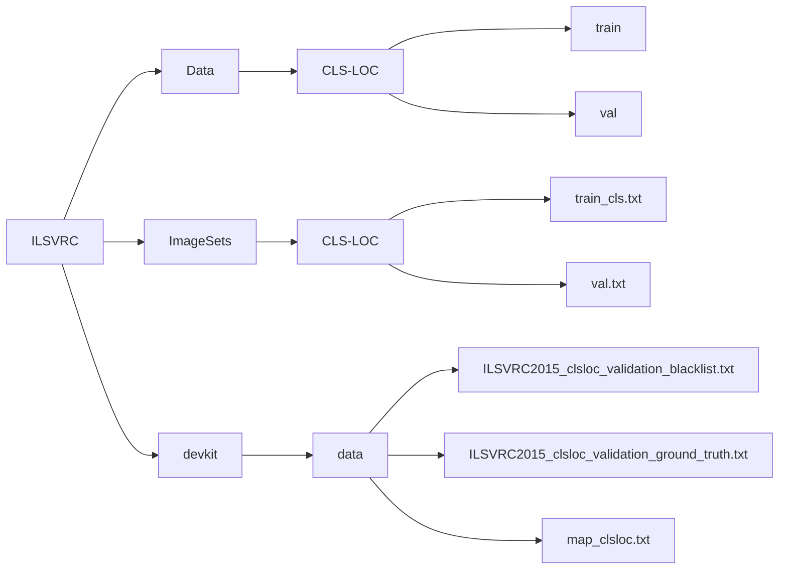

# Download ImageNet Dataset

ImageNet Dataset can be downloaded from either the [official site](https://www.image-net.org/download.php) or [Kaggle](https://www.kaggle.com/competitions/imagenet-object-localization-challenge/data).

The official site requires the registration firstly. You may need to register because "devkit" is an essential file and it can be simply downloaded on the official site.

# Brief Introduction to Dataset

This dataset spans 1000 object classes and contains 1,281,167 training images, 50,000 validation images. We take validation images as testing set. Then, 20% training images are extracted out and renamed as validation images. After adjustment, there are 1,024,977 training images, 256,190 validation images, and 50,000 testing images.

# File Sructure

Unzipping the download files returns you the following file structure. "devkit" file will be added under the directory of ILSVRC after unzipping.

We assume that the target task is classificaiton. Then, all files that our code needs are shown below. Simultaneously, we automatically ignore those unrelated files.

