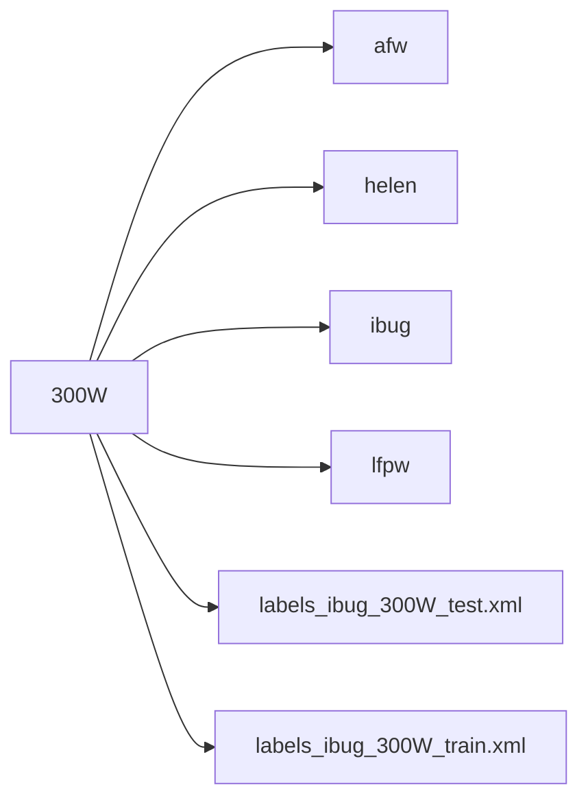

# 300W dataset

## Introduction

300W dataset consists of 5 facial datasets named after LFPW, AFW, HELEN, XM2VTS, and IBUG. 
The official document said they get split into a training set with 3,148 images and a testing set with 689 images where 554 images are from LFPW and HELEN, 135 from IBUG. 
Furthermore, images from LFPW and HELEN form the common testing subset; those from IBUG are regarded as the challenging testing subset. 
Both of these two subsets form the full testing set. Each image has 68 landmark points.

## File Structure

According to related academic papers, researchers usually split the testing images into three sets, challenging, common, and full. 
Referring to online materials, photos from ibug belongs to challenging set, while photos from lfpw and helen belongs to common set. 
It's easy to split them during loading dataset by if-else statement. 

Hence, we don't need extra code.
