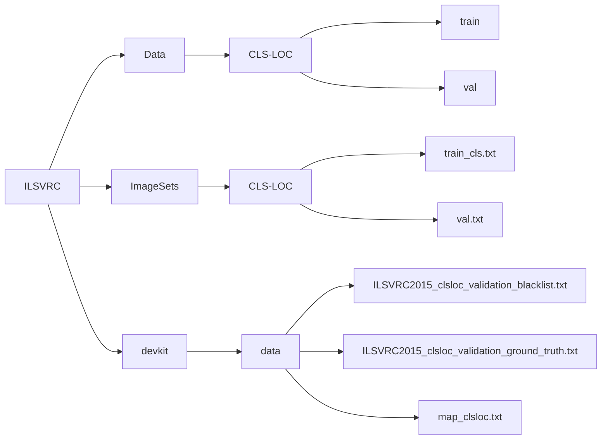
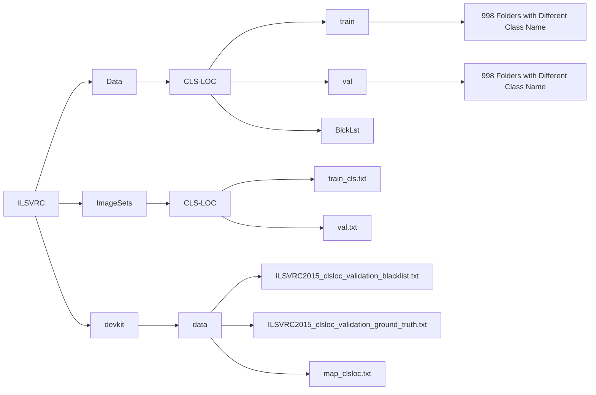

# Prepare ImageNet dataset for training models on Tensforflow 2.X

# Download ImageNet Dataset

ImageNet Dataset can be downloaded from either the [official site](https://www.image-net.org/download.php) or [Kaggle](https://www.kaggle.com/competitions/imagenet-object-localization-challenge/data).

The official site requires the registration firstly. You may need to register because "devkit" is an essential file and it can be simply downloaded on the official site.

# Brief Introduction to Dataset

This dataset spans 1000 object classes and contains 1,281,167 training images, 50,000 validation images. We take validation images as testing set. Then, 20% training images are extracted out and renamed as validation images. After adjustment, there are 1,024,977 training images, 256,190 validation images, and 50,000 testing images.

# Folder Sructure

Unzipping the download files returns you the following folder structure. "devkit" file will be added under the directory of ILSVRC after unzipping.

We assume that the target task is classificaiton. Then, all folders and files that our code needs are shown below. Simultaneously, we automatically ignore those unrelated files.



# Code Description

Framework: Tensorflow 2.X  
Package: ImageDataGenerator  
Function: .flow_from_directory()  
Study Sources: [1. TensorFlow Documentary](https://www.tensorflow.org/api_docs/python/tf/keras/preprocessing/image/ImageDataGenerator), [2. Machine Learning Tutorials
](https://studymachinelearning.com/keras-imagedatagenerator-with-flow_from_directory/), [3. Keras Documentary](https://keras.io/api/preprocessing/image/), [4. Medium](https://medium.datadriveninvestor.com/keras-imagedatagenerator-methods-an-easy-guide-550ecd3c0a92).  
Import the package ```from tensorflow.keras.preprocessing.image import ImageDataGenerator```.

```ImageDataGenerator.flow_from_directory()``` takes the directory path as input value. Each directory contains many folders. The number of folders equal to the category number. Each folder only includes the images of related category.

Next, let's see our folders.

## Train

```train_cls.txt``` shows the file name of all training images.  
```map_clsloc.txt``` shows the corresponding category name of each folder.

To prepare training set, we need to assign correct catogory name to each folder and keep the corresponding images.

## Validation
```val.txt``` shows the file name of all validation images.  
```ILSVRC2015_clsloc_validation_ground_truth.txt``` shows the label of each image.  
```ILSVRC2015_clsloc_validation_blacklist.txt``` shows the blacklist of validation images, which are the indexes.

To prepare the testing set, we need to move the related images into new created folders named by different category names. We also need to create a folder named ```BlckLst``` to hold all images in the black list.

# Run Code

Read Code firstly and change to fit your folder names. Then, run this code.

```python3 data_prepare.py```

# Output File Structure



# OK to Go

Now, the ImageNet dataset is ready for you to train on your model.
